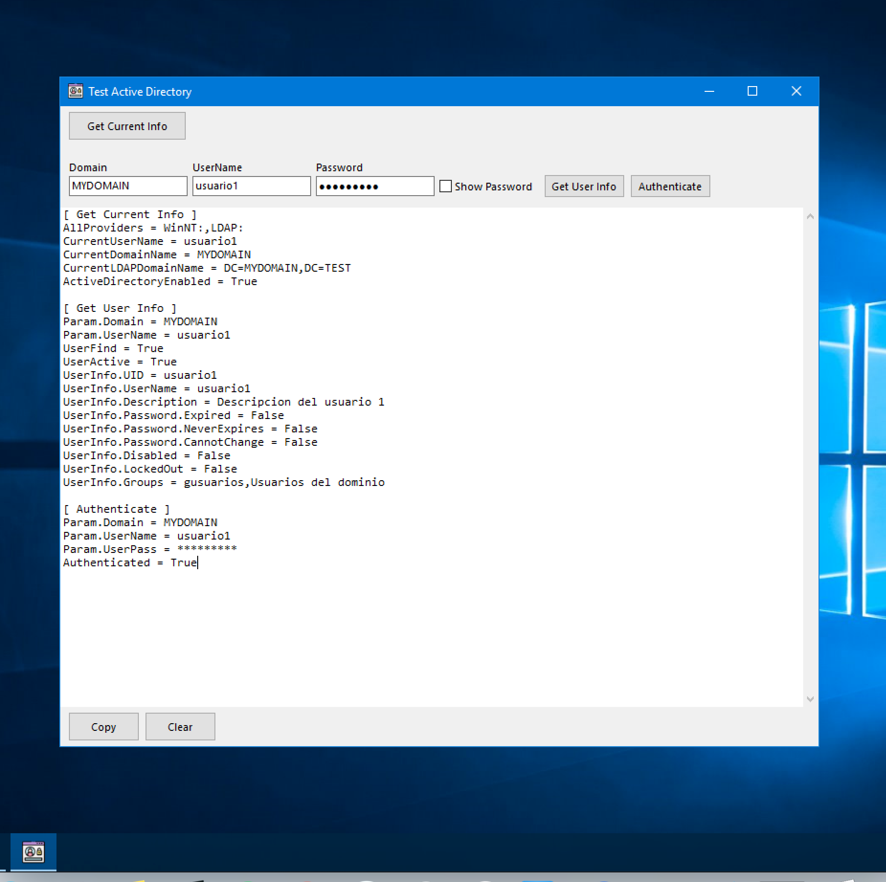

<p align="center">
  
</p>

# ActiveDirectory4Delphi 


[](https://twitter.com/ZavaDev)

Delphi library (Basic) for validation and authentication of LDAP users in Active Directory

> It also has an application to test the library with Active Directory.

## ✨ App Demo


[Download App](https://github.com/EdZava/VCL-ActiveDirectory4Delphi/releases/latest/download/VCLActiveDirectory.zip)

Example of use of the application and the information retrieved in the log.

<p align="center">
  
</p>

### Get Current Info 

Retrieve the information of the current section.

Sample Log:
```log
AllProviders = WinNT:,LDAP:
CurrentUserName = usuario1
CurrentDomainName = MYDOMAIN
CurrentLDAPDomainName = DC=MYDOMAIN,DC=TEST
ActiveDirectoryEnabled = True
```

### Get User Info

Retrieve user information using the domain and user indicated in the text boxes.

Sample Log:
```log
Param.Domain = MYDOMAIN
Param.UserName = usuario1
UserFind = True
UserActive = True
UserInfo.UID = usuario1
UserInfo.UserName = usuario1
UserInfo.Description = Descripcion del usuario 1
UserInfo.Password.Expired = False
UserInfo.Password.NeverExpires = False
UserInfo.Password.CannotChange = False
UserInfo.Disabled = False
UserInfo.LockedOut = False
UserInfo.Groups = gusuarios,Usuarios del dominio
```

### Authenticate

Authenticate using the domain and user indicated in the text boxes.

Sample Log:
```log
Param.Domain = MYDOMAIN
Param.UserName = usuario1
Param.UserPass = *********
Authenticated = True
```

## Example usage library

```delphi
uses
  Common.ActiveDirectory.Utils;

...

// example authenticate current user
procedure Authenticate(UserPass: string);
var
  CurrentUserName: string;
  CurrentDomainName: string;
  CurrentLDAPDomainName: string;
begin
  if (not TActiveDirectoryUtils.GetActiveDirectoryEnabled) then
    Exit;

  CurrentUserName := TActiveDirectoryUtils.GetCurrentUserName;
  CurrentDomainName := TActiveDirectoryUtils.GetCurrentDomainName(CurrentUserName);  
  CurrentLDAPDomainName := TActiveDirectoryUtils.GetCurrentLDAPDomainName(CurrentDomainName);  

  if TActiveDirectoryUtils.AuthenticateUser(CurrentLDAPDomainName, CurrentUserName, UserPass) then
    ShowMessage('ok')
  else
    ShowMessage('Fail');
end;

// example validation user
procedure ValidationUserActive(DomainName, UserName: string);
begin
  if TActiveDirectoryUtils.GetUserActive(DomainName, UserName) then
    ShowMessage('ok')
  else
    ShowMessage('Fail');
end;
```

more information look at the unit [Common.ActiveDirectory.Utils](./src/Common/Common.ActiveDirectory.Utils.pas)

## Author

👤 **Zava**

* Twitter: [@ZavaDev](https://twitter.com/ZavaDev)

## Show your support

Give a ⭐️ if this project helped you!
